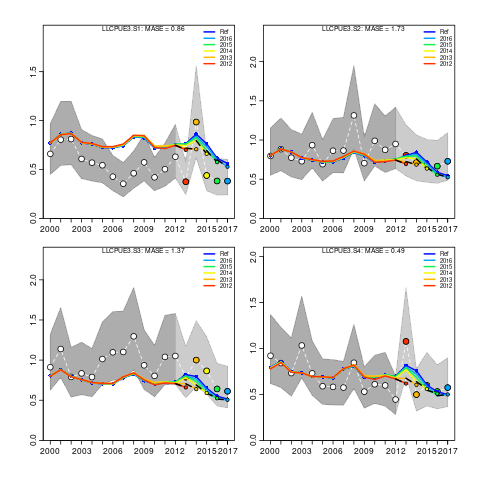
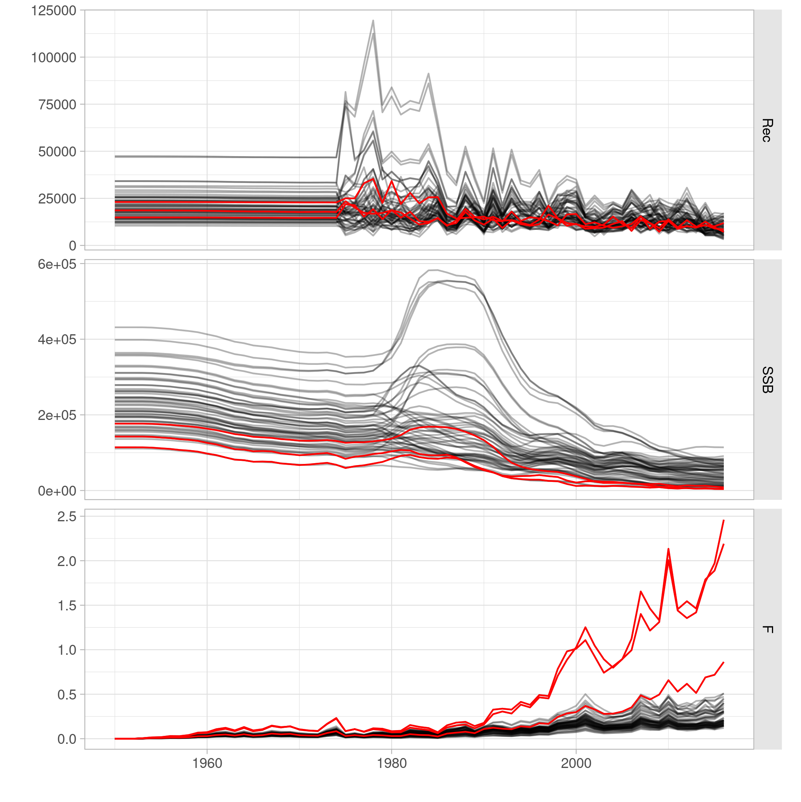

```{r,setup, include=FALSE}
library(knitr)
opts_chunk$set(cache=TRUE, echo=FALSE, fig.align="center", out.width="70%")
```

# Background

- 3rd iteration of albacore OM.
- To be based on WPTmT 2019 SS3 model.
- Contract WMR - IOTC/FAO signed August.
- Initial exploration new OM.
- Existing FLR platform for SS 3.30.16.
- `https://github.com/iotcwpm/alb`

# WPTmT 2014 ALB OM grid

| Factor              | N | Prod | Values                   |
|---------------------|---|------|--------------------------|
| Natural mortality   | 5 | 5    | 0202, 0303, 0404, 0403, 0402 |
| Steepness SRR       | 3 | 15   | 0.7, 0.8, 0.9            |
| sigma reecruitment  | 2 | 30   | 0.4, 0.6                 |
| ESS length comps.   | 3 | 90   | 20, 50, 100              |
| CV CPUE             | 4 | 360  | 0.2, 0.3, 0.4, 0.5       |
| LL q increase       | 2 | 720  | 0%, 0.25% per quarter    |
| Selectivity form    | 2 | 1440 | logistic, double normal  |

# WPTmT 2014 ALB OM

```{r oldom}
include_graphics("../figures/om2016.png")
```

# The WPTmT 2019 SS3 albacore stock assessment

```{r base_runs}
include_graphics("../../output/data/runs_wp_select.png")
```

# Fleet spatial structure

{ width=45% }
{ width=45% }

# Model diagnostics: Retrospective analysis

```{r retrobase}
include_graphics("../../output/base/retro_SSB.png")
```

# Model diagnostics: CPUE runs tests

```{r runstestCPUE}
include_graphics("../../output/base/runs_CPUE.png")
```

# Model diagnostics: LF runs tests

```{r runstestLF}
include_graphics("../../output/base/runs_LF.png")
```

# Model diagnostics: Hindcasting cross validation

{ width=45% }
{ width=45% }

- MASE < 1: LLCPUE3 S4, LLCPUE1 S1, S4

# Parameter uncertainty: MVLN

```{r kobe}
include_graphics("../../output/base/kobe.png")
```

# Initial Operating Model grid

- Natural mortality (M): 0.3, 0.325, 0.35, 0.375  or 0.4, for all ages.
- SD recruitment deviates (sigmaR): 0.4, 0.6, or 0.8.
- SRR steepness (h): 0.7, 0.8 or 0.9.
- LL CPUE series (cpues): Northwest (12) or Southwest (14).
- LF data lkhd weighting (lfreq): 0.001, 0.01, 0.1 or 1.
- Catchability increase LL CPUE (llq): 0% or 1% per year.

# Main effects: Change in SB0, SBMSY by factor

{ width=45% } { width=45% } 

# Grid corners

- From M=0.3, sigmaR=0.4, h=0.7, NW CPUE, LF lambda = 0.001 and LL q = 0%
- To M=0.4, sigmaR=0.8, h=0.9, SW CPUE, LF lambda = 1 and LL q = 1%
- 64 (2^6) model runs:
  - 5 with final gradient > 1e-4.
  - 2 with $B_0 > 1e7$.

```{r cornersssb0, out.width="40%"}
include_graphics("../../output/corners/ssb0_distr.png")
```

# Grid corners

```{r cornersruns, out.width="40%"}

```

|   M| sigmaR| steepness| cpues| lfreq|  llq|
|---:|------:|---------:|-----:|-----:|----:|
| 0.3|    0.8|       0.9|    14| 1.000| 1.00|
| 0.3|    0.8|       0.7|    12| 0.001| 1.01|
| 0.4|    0.8|       0.7|    12| 0.001| 1.01|

# Regression tree

```{r regtrees}
include_graphics("../../output/corners/regtrees.png")
```

# Operating Model reference case grid (108 runs)

- M: 0.3, 0.35, or 0.4, for all ages.
- sigmaR: 0.4, 0.6, or 0.8.
- h: 0.7, 0.8 or 0.9.
- lfreq: 0.01, or 1. Maybe others.
- llq: 0% or 1% per year.
- LL CPUE serie Southwest (14).

## Alternatives

- LL CPUE Northwest (12).
- lfreq weighting of PS LF.

# Open questions

- Smaller grid still sufficient ?
- Weighting scheme worth considering or ...
- ... Equal weighting and resampling ?
- Choice of reference case CPUE (SW 14).
- Range of ages F calculation: 1-12
