\thispagestyle{fancy}

```{r, knitr, echo=FALSE, message=FALSE}
library(knitr)
opts_chunk$set(echo=FALSE, message=FALSE, warning=FALSE, fig.align="center",
  fig.width=5, fig.height=3, fig.pos='!htb', out.width="50%")
```

# Introduction

This document presents the first steps in the developments for the conditioning of a new Operating Model (OM) for Indian Ocean albacore. A contract has been recently signed between the Indian Ocean Tuna Commission (IOTC) and Wageningen Marine Research (WMR), under which further development of a Management Strategy Evaluation for this stock will take place.

The previous OM [@Mosqueira_2018] consisted of a large number of Stock Synthesis model runs, 1,440. A grid was constructed for all combinations of alternative levels for a number of model assumptions, which were then treated as equally likely.

A new stock assessment for albacore [@Langley_2019] was carried out and accepted by WPTmT in 2019. A number of changes in both inputs and model structure led to a different perception of stock status and dynamics. This made the WPTmT request that the albacore OM be reconditioned based on the latest data, and using as base the new assessment model [@IOTC_WPTmT07AS].

Work on this project has started, although it is still at a very preliminary state. The author is therefore at this point seeking guidance from the WPM on the strategy for development on the OM. In contrast with the previous OM, factors and levels to include in the base case are being more carefully selected. The intention is to obtain a more robust view of the important sources of uncertainty for this stock, using a smaller size grid. A possible weighting scheme, that considers the plausibility of each model run in the OM grid, is also being considered.

Three system characteristics of the Operating Model and the Observation Error Model are likely to have the greatest influence in the performance of an MP: scale, noise and trend. The strategy for development of an MP described here tries to ensure that a realistic range of options for those three quantities are present in the OM set. Metrics that represent those three characteristics are described, but their suitability and usefulness needs further investigation.


# The WPTmT 2014 albacore operating model grid

The previous operating model grid for albacore included alternative values for seven variables, as listed in Table 1. A full factorial design was applied, so all 1,440 models were run and checked for convergence. All runs were then included in the base case OM, although for computational efficiency, a random sample of 1,000 of the were used for the evaluation of Management Procedures (MPs). Further details on the factors in the grid can be found in past WPM reports and working documents [@Mosqueira_2018; @WPM_2018; @WPM_2019]. The uncertainty in past dynamics quantified by this operating model was fairly large (Figure \ref{fig:oldom}).


| Factor                            | Levels (n) | prod n | Values                   |
|-----------------------------------|------------|--------|--------------------------|
| Natural mortality (M)             | 5          | 5      | 0202, 0303, 0404, 0403, 0402 |
| Steepness of the stock-recruitment relationship | 3     | 15     | 0.7, 0.8, 0.9   |
| Variability of recruitment (sigmaR)             | 2          | 30     | 0.4, 0.6   |
| Effective Sampling Size of the length composition data (ESS) | 3 | 90 | 20, 50, 100 |
| CV for fit to CPUE (cpuecv)                     | 4    | 360 | 0.2, 0.3, 0.4, 0.5  |
| Increase in catchability coefficient of CPUE (llq) | 2 | 720 | 0%, 0.25% per quarter |
| Selectivity (llsel)              | 2          | 1440   | logistic, double normal   |

Table: Variables and levels employed in the previous albacore OM grid, based on the 2016 stock assessment model. Natural mortality levels refer to the initial value from age 1 (first two digits) and the value for ages >5 (second two digits). A linear decrease was applied to the mortality for ages between 1 and 5.

```{r oldom, fig.cap="Uncertainty in the spawning stock biomass trajectory constructed from the previous operating model."}
include_graphics("figures/om2016.png")
```

# The WPTmT 2019 SS3 albacore stock assessment

The last session of the IOTC Working Party on Temperate Tunas, WPTmT [@IOTC_WPTmT07AS], reviewed and approved a new stock assessment [@Langley_2019] for the albacore stock. The model has been constructed using the Stock Synthesis platform [@Methot_2013], version 3.30. This is a seasonal, two-sex model, where catch data and indices of abundance are split across four areas (Figure \ref{fig:areas}), mostly to account for differences in the sizes of fish caught in the Northern and Southern areas.

```{r areas, fig.cap="Spatial structure of the Indian Ocean albacore SS3 stock assessment model."}
include_graphics("figures/areas_albacore.png")
```

Data is available from the beginning of the industrial fisheries (Figure \ref{fig:data}), but their quality, and the amount of information contained, has varied over time through changes in the activities of some of the fleets, and lack of sampling in others.

```{r data, fig.cap="Temporal coverage and sources of catch, relative abundance and length composition data employed in the stock assessment model."}
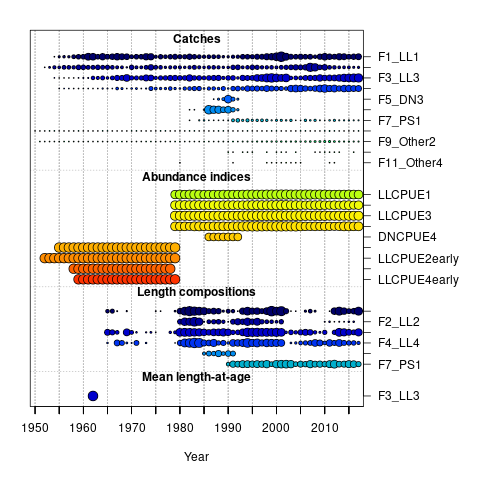
```

Longline CPUE indices by area have been incorporated that are the result of a collaborative study across all longline fleets [@Hoyle_2019]. The standardised indices were derived from operational-level longline data from the three fleets (Japan, Taiwan and Korea), and using  cluster analyses to consider the effects of target change, vessel effects and spatial effects. Indices have been included for the period 1979–2017 (Figure \ref{fig:indices_recent}, as trends in years earlier than 1979 cannot be explained with the catches taken in those years.

```{r indices_recent, fig.cap="Indices of abundance employed in the SS3 stock assessment model in the later period."}
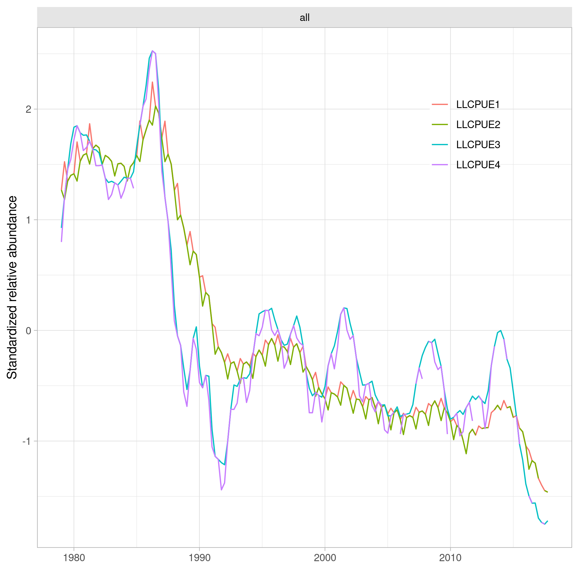
```

```{r base_runs, fig.cap="Time series (recruitment, SSB, catch and fishing mortality) for the three stock assessment runs used for advice by WPTmT (IOTC, 2019)."}
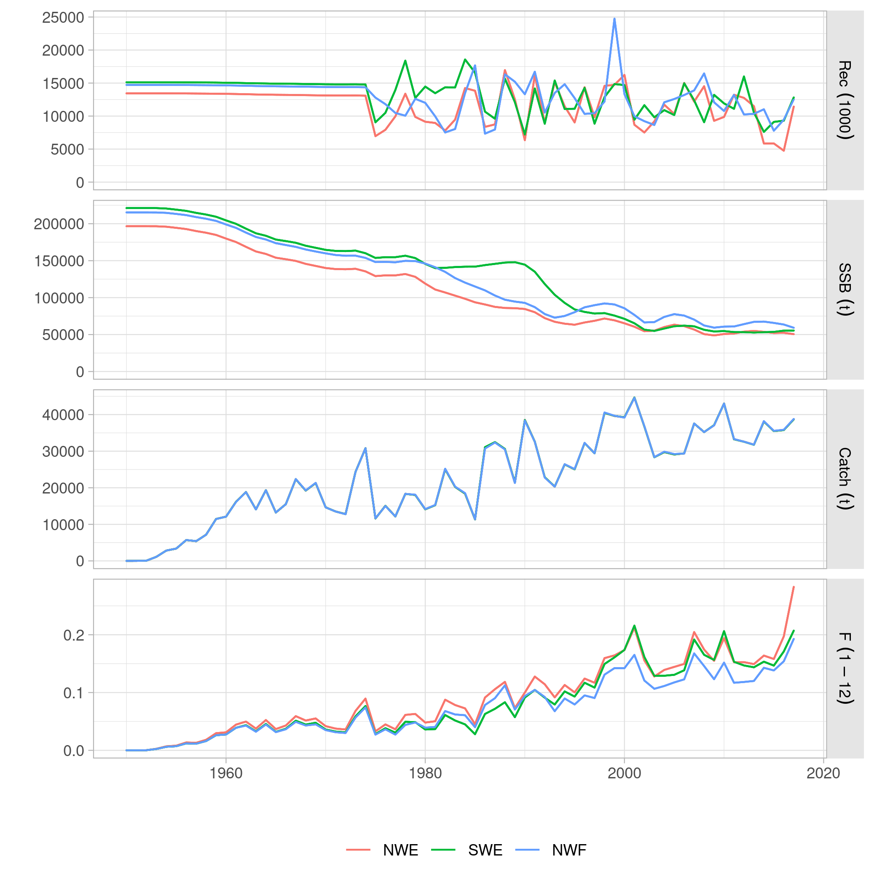
```

Selectivities at age for the longline fleets in the four regions (Figure \ref{fig:cpueselex}) reflect the distinction in the ages available in the Northern and Southern areas of distribution. The effect of choosing a Northern or Southern index in a candidate Mp will need to be considered, as they could be expected to provide information on different sections of the populations. Southern indices, for example, with a narrower selectivity profile, could be more affected by the delay between abundance signal and management. The current two year gap in data collection for albacore CPUE and catch data might prove important in those cases.

```{r cpueselex, fig.cap="Estimated selectivities at age for each of the four recent Longline CPUE indices (LLCPUE1-4).", fig.out="40%"}
include_graphics("../output/data/index_selex_2017.png")
```

The current stock assessment results in estimates of biomass that are approximately one third lower than those obtained by the 2016 model. There are four main changes in the new assessment ([@Langley_2019]):

- Refinements to the spatial distribution of catches from the longline fishery. Catches for the LL1 and LL2 fisheries have increased, while those for LL3 and LL4 have decreased.
- The main CPUE index in the assessment (LL3) has been revised and extended, and now shows a greater decline in stock abundance.
- A new set of growth parameters, obtained from work carried out on sampled from the Indian Ocean, are now used in the model.
- Changes in the configuration of the longline length composition data, which altered the estimates of both biomass and depletion level.

```{r runs2014, fig.cap="Stock trajectories for the three 2019 base case runs, compared with the WPTmT 2016 (SA2014) stock assessment.", fig.out="40%"}
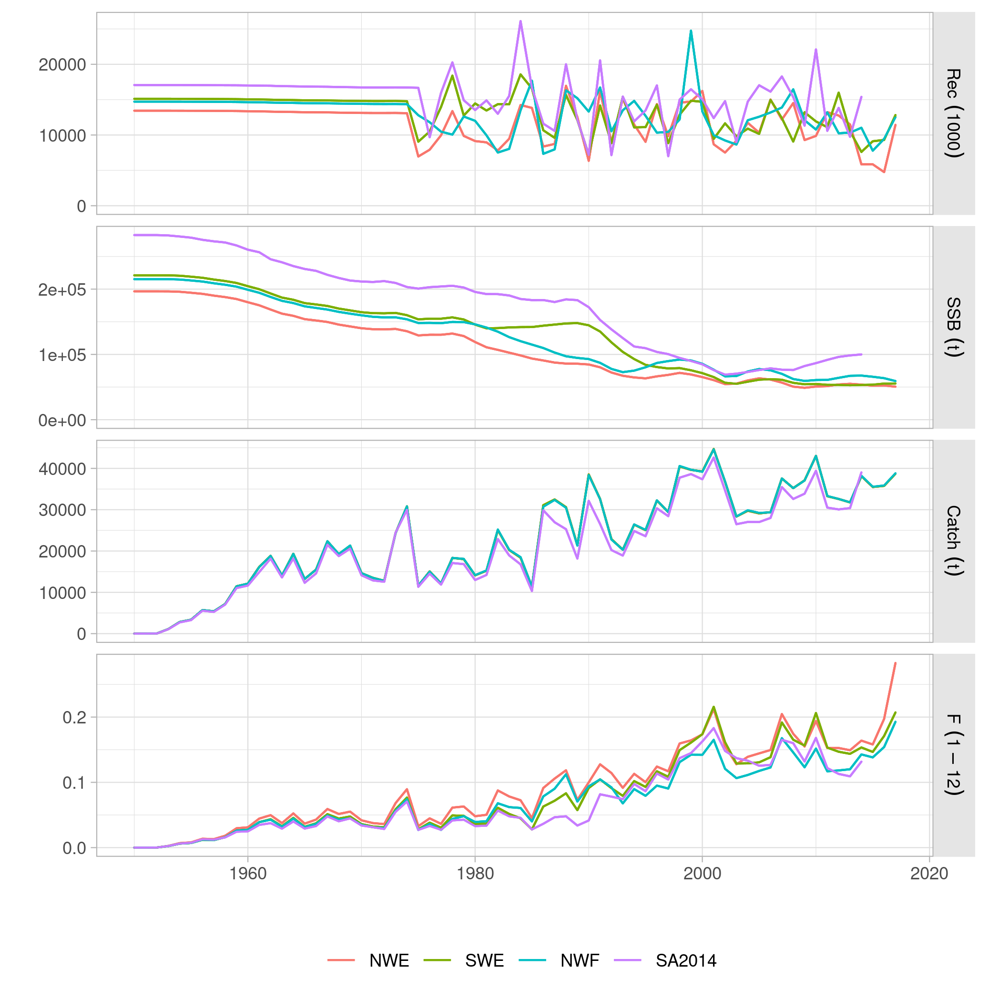
```

Finally, the WPTmT considered that both natural mortality and stock-recruitment steepness were important factors that should ideally be considered in the stock assessment grid.

\clearpage

## Model diagnostics

An initial set of model diagnostics, following [-@Carvalho_2020], are being explored to (i) assess the quality of fit of each run in the grid, and (ii) see about their use to provide weights to use in any subsample/resample procedure. Diagnostics to be applied to the whole grid should be computationally feasible. A retrospective analysis, for example, would require 5 extra model runs for each model in the grid, when a single run of the base case model takes already over 65 min. Convergence is assessed by the invertion of the Hessian matrix, and the value of the gradient at the solution. This is checked to be smaller than 1e-4 [@Carvalho_2020].

### Retrospective analysis

Retrospective analysis is a form of hindcasting commonly used to assess the stability of a model formulation to updates in the data. An statistic, for example Mohn's *rho* [@Mohn_1999], is then used to quantify the strength of the retrospective pattern. A subjective rule might be established where model runs with values larger than a certain limit are deemed invalid. For example, [-@Hurtado_Ferro_2014] proposed that values outside the -0.15 to 0.20 range, should indicate an undesirable retrospective pattern for longer lived species.

The retrospective pattern for the estimated SSB from the base case model is shown in Figure \ref{fig:retrobase}. This plot also includes a one-step ahead projection of SSB based on the known total catches. The usefulness of a retrospective statistic is less clear in an operating model context, but its value at signalling models for which future bias could be a cause of instability in the application of an MP.

```{r retrobase, fig.cap="Five year restrospective runs with a one step ahead forecast of SSB according to total catch."}
include_graphics("../output/base/retro_SSB.png")
```

### Runs tests

Runs tests on the CPUE and length-frequency data sources are common diagnostics of goodness of fit [@Carvalho_2017]. The Wald-Wolfowitz runs test, a non-parametric statistical test
that checks the randomness hypothesis for a data sequence, can be used to identify residuals patterns that should not be considered random. The runs test for the CPUEs and for the length-frequency data sources in the base case stock assessment (Figures \ref{fig:runstestCPUE} and \ref{fig:runstestLF}) indicate that the model fit to most data series (those in red) present significant patterns. Model fits where the fit to the chosen CPUE does not pass the Wald-Wolfowitz runs test could be identified and not incorporated to the base case OM.

```{r runstestCPUE, fig.cap="Runs tests of the four ongoing CPUE series."}
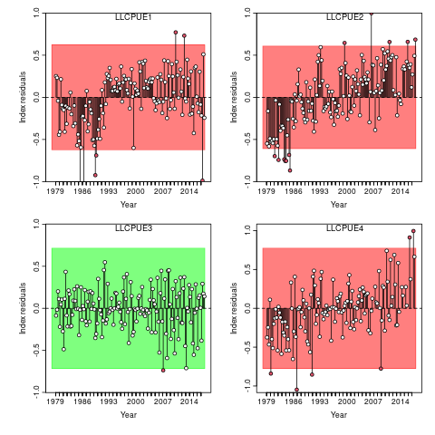
```

```{r runstestLF, fig.cap="Runs tests for the various sources of length frequency data."}
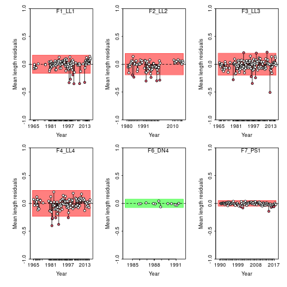
```

### Hindcasting cross validation

A proposed model-free hindcasting technique (HCXval) uses cross-validation to compare observations to their predicted future values [@Kell_2016]. The prediction skill of a model is then computed from the prediction residuals. A robust statistic for evaluation the prediction skill can be constructed using the mean absolute scaled error (MASE) of [-@Hyndman_2006]. The R package *ss3diags* contains functions that simplify the calculation of prediction skill and the computation of their MASE for both CPUE and length frequencies.

The prediction skills of both the Northwestern (LLCPUE1) and Southwestern (LLCPUE3) indices are presented in Figure \ref{fig:mase1}. A MASE score larger than 1 indicates the model does only as well as a random walk at predicting the quantity, while a value of 0.5 indicates the model is twice as good as a random walk. For both indices, the model prediction skill appears to be better for seasons 1 and 4, the later being the spawning season for this stock. These results could indicate that a single season CPUE, or a combination of seasons 1 and 4, could provide a better indication of stock status and trends to inform the management procedure.

```{r mase1, fig.cap="Hindcasting cross-validation results by season for the LLCPUE1 and LLCPUE3 indices.", out.width="45%", fig.show = "hold", fig.subcap = c("a", "b")}
include_graphics(c("../output/base/mase1.png", "../output/base/mase3.png"))
```

\clearpage

## Parameter uncertainty

The previous albacore operating model did not incorporate parameter uncertainty, only considering the structural uncertainty as characterized by the variables included in the grid. A comparison of both sources of uncertainty should help informing on whether this should still be the case. Figure \ref{fig:kobe} presents the uncertainty in the estimates of current status, as generated from a Multivariate Log-Normal distribution [@Winker_2019].

```{r kobe, fig.cap="Uncertainty in the estimates of status (F/FMSY and B/BMSY) of the albacore base case model.", out.width="40%"}
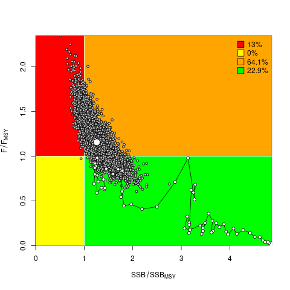
```

An easier comparison can be made between the estimates of virgin biomass from the corners of the proposed grid (Figure \ref{fig:cornersssb0}) and the uncertainty in the estimate of biomass at the very start of the series (1952) obtained through the MVLN method (Figure \ref{fig:ssb1952}). It appears that the scale of variability is clearly lower, as expected, when only parameter uncertainty is considered.

```{r ssb1952, fig.cap="Uncertainty in the estimates of SSB in 1952 from the albacore base case model.", out.width="40%"}
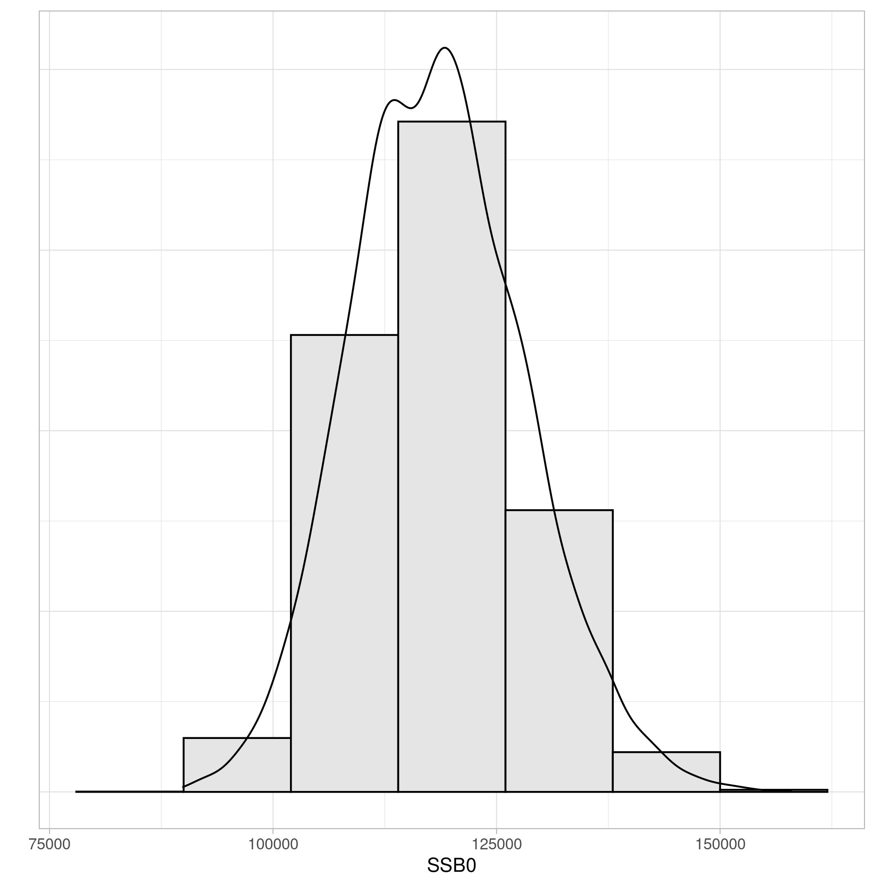
```

\clearpage

# Operating Model grid proposal

An analysis has been carried out (Kell et al, *unpublished*) attempting to extract some learnings about the process of setting up a grid that account for model uncertainty, using the albacore model grid as a case study. The main lessons of direct application to the new grid are the following:

- The effect of natural mortality was limited to the values chosen for mature ages, which are targeted and caught by the longline fisheries. As has been done in the new stock assessment [@Langley_2019], alternative values for M should be applied to all ages.

- Weighting of the length frequency (ESS) and CPUE data (CPUECV) have a strong impact on model estimates of both stock biomass and current status. The previous grid treated them as independent factors and considered all possible combinations of the levels for both. But it is the relative weight of either data source that needs to be considered. This is better set as a series of contrasting scenarios, in which the importance of the length frequency data is considered. This can now be carried out in a simpler manner in SS 3.30 by using multipliers for the two likelihood components (*lambdas*).

An initial proposal for an OM grid has been explored that includes the following factors and levels:

- Natural mortality (M): 0.3, 0.325, 0.35, 0.375  or 0.4, for all ages.
- Standard deviation in recruitment deviates (sigmaR): 0.4, 0.6, or 0.8.
- Stock-recruitment relationship steepness: 0.7, 0.8 or 0.9.
- LL CPUE series (cpues): Northwest (12) or Southwest (14).
- Length-frequency data likelihood weighting (lfreq): 0.001, 0.01, 0.1 or 1.
- Catchability increase of the LL CPUE series (llq): 0% or 1% per year.

## Limits to low natural mortality values

Initial design of the grid attempted to set alternative values for each factor on both sides of the base, except for those of a binary nature (e.g. choice of CPUE). For natural mortality, the initial choice was therefore for three values: 0.2, 0.3 and 0.4. Runs with M=0.2 resulted in unrealistic estimates of virgin biomass, larger than 1.5 Mt. The levels for this factor in the initial grid were reformulated to extend between the two alternatives already explored in the stock assessment grid, 0.3 and 0.4 [@Langley_2019]. Values lower than 0.3, for example 0.25, could be explored before a final grid is agreed.

## Main effects

A first exploration has been carried out of the individual effect on model output of adopting an alternative value for each variable, one at a time. These *main effects* provide an useful indication of how much variability in dynamics and status is controlled by a single variable, and how much is the result on 2nd or higher order interactions. The estimates of the scale indicator (virgin spawning biomass) are shown in Figure \ref{fig:mainssb0}, while those for trend (SSB in 2017 over SSB at MSY) are presented in Figure \ref{fig:mainssbmsy}.


```{r mainssb0, fig.cap="Changes in estimates of virgin spawning biomass (SSB0) under each factor and value. Horizontal line shows the reference estimate for the base case model run."}
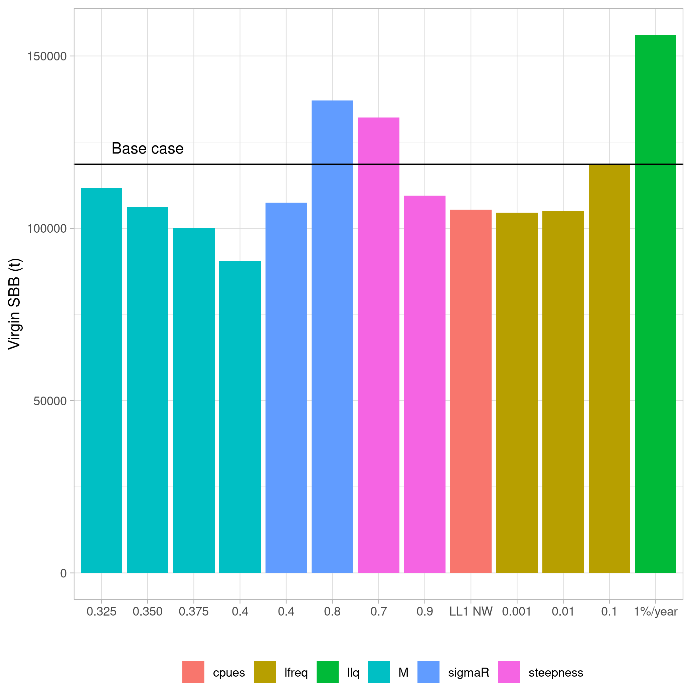
```

```{r mainssbmsy, fig.cap="Changes in estimates of spawning stock biomass (SSB) in the last year (2017) over the SSB at MSY, under each factor and value. Horizontal line shows the reference estimate for the base case model run."}
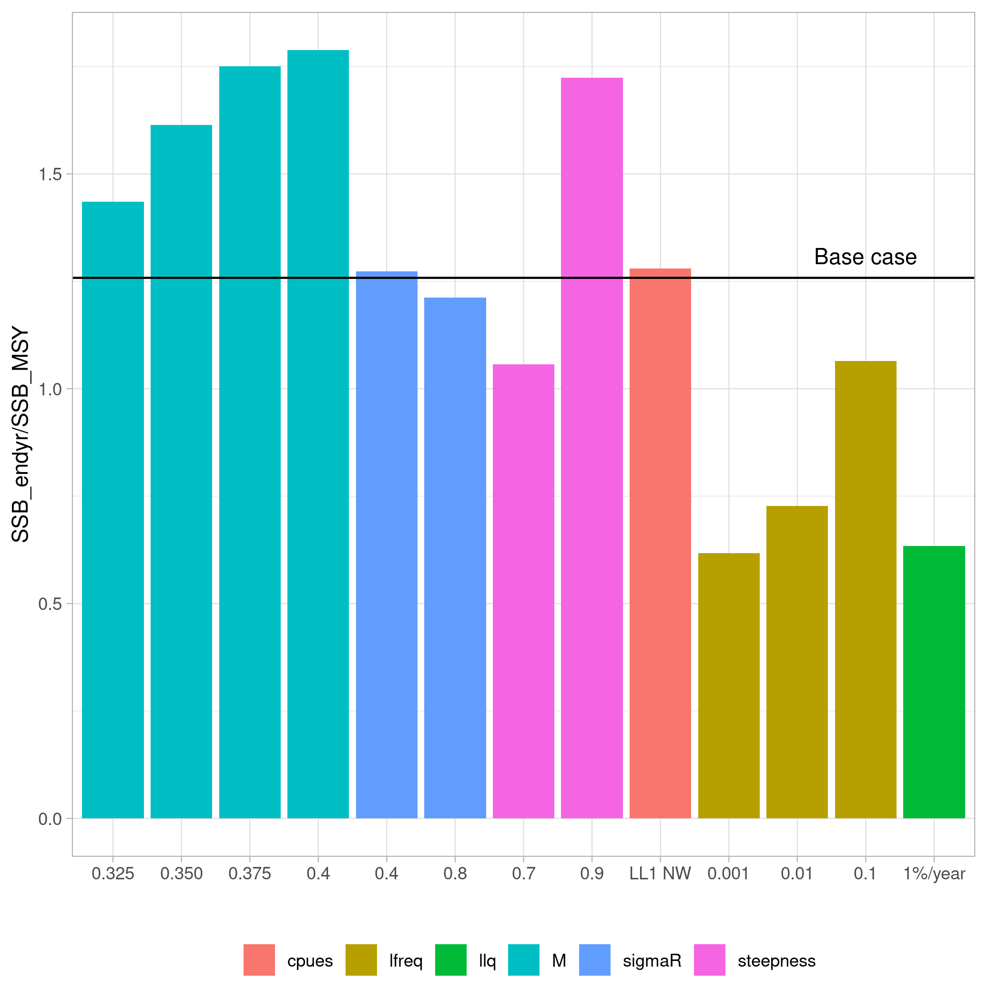
```

## Grid corners

An initial exploration of the OM grid has been carried out by looking at the results of running the *corners* of the grid. This refers to all combinations of the extreme values for each of the factors. For example, the first element in this grid takes the *lowest* value for each factor (M=0.3, sigmaR=0.4, steepness=0.7, NW CPUE, LF data lambda = 0.001 and LL catchability increase of 0%). A total of 64 (2^6) model runs form this grid. A first test of convergence showed five models resulted in a final gradient value larger than 1E-4. These model will be subsequently re-run using the *jitter* procedure, that generates a set of different starting values. Further investigation of other convergence criteria, for example how close final parameter estimates are to the set bounds, and the coefficients of variation of estimated quantities [@Carvalho_2020], will be carried out.

Two other model runs returned extremely high estimates of virgin biomass, $B_0 > 1e7$, and have been initially dropped from the results presented here. No single factor appears to be responsible for this outcome. Subsequent analysis of the results, e.g. closeness to bounds, will be carried out. The distribution of the estimates obtained from the remaining 57 runs is presented in Figure \ref{fig:cornersssb0}.

```{r cornersssb0, fig.cap="Distribution of the estimates of virgin spawning biomass (*SSB0*) from the 57 valid runs of the corners of the full grid"}
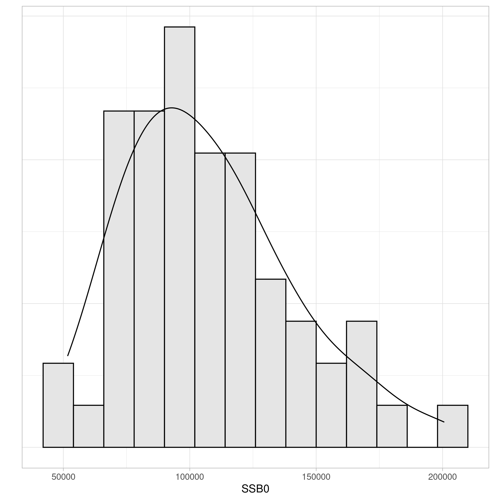
```

Three indicators are being selected for the three system characteristics (scale, noise and trend) that could be expected to have the greatest effect in MP performance, as mentioned before. Scale is represented by the estimate of virgin spawning biomass ,*SSB0*, noise by the standard deviation of the stock-recruitment residuals, *sigma(Rec)*, and trend by the ratio of SSB in the final year to SSB at MSY, *SSB/SSBMSY*. A recursive regression tree (@Breiman_1983, as implemented by the *rpart* package) was fitted to the three indicators against the six variables currently present in the grid. The corresponding trees are shown in Figure \ref{fig:regtrees}. The results appear to indicate that natural mortality (M), the wight assigned to the length-frequency data in the likelihood (lfreq) and the consideration or not of an increase in LL catchability (llq) appear to be the three factors explaining the differences in those three system characteristics. The choice of CPUE also affects to some degree the variability in recruitment, but could be displaced from the base case grid to a robustness test. The quality of information on the CPUE is, however, an important decision for the Observation Error Model. The quality of either index might need to be further evaluated before a decision can be made.

```{r regtrees, fig.cap="Regression trees for three quantities of interest: Virgin SSB, SSB at MSY and variance in log scale of the recruitment residuals."}
include_graphics("../output/corners/regtrees.png")
```

## Potential robustness tests

The latest albacore stock assessment [@Langley_2019] included a series of runs that looked at the effect of the purse seine length frequency data in the model estimates. The grid presented here does not include alterations to the relative weighting of these data. Despite this fleet contributing to a small amount of the total catch, its length frequency data appears to have a large influence in bringing biomass estimates to be lower than previously. Alternative weighting for this dataset should be considered, either as a robustness model, or as part of the main grid.

Other factors and assumptions in the model were included in a exploratory grid that was part of the stock assessment exercise [@Langley_2019]. Some of these, for example the growth curve, could be considered for additional robustness tests, if the WPTmT and WPM consider them worth of further investigation.

# Discussion

The initial lines of work that are being taken for the development of a new operating model for albacore tuna are presented here. These proposals reflect some of the lessons learned from the previous operating model grid. This includes concerns about equal weight given to model runs that were not equal in their ability to explain the data. Also, the level of replication in the previous grid, where multiple runs reflected the same past dynamics despite being generated by different variable combinations.

The current grid proposal looks at incorporating sufficient contrast in the three elements in the stock dynamics deemed to determine the likely performance of any management procedure: stock status and scale, variability and noise, and population trends. The three metrics chosen to represent those elements have been used to identify how much their variability is determined by different variables in the model grid. The robustness of those preliminary findings to alternative metrics should be investigated. Work based on the previous albacore grid, still ongoing, is also looking at how the performance of different types of MPs relate to those OM elements.

A large part of the differences in model dynamics are driven by the relative weights of the two sources of information for this model, length-frequency and CPUEs. The current grid attempts to explore a range of options for this variable by giving different multipliers to the individual likelihood components. Whether this mechanism is valid, and the range of values this could take, is open to discussion. Consideration of the effect of the purse seine length frequency data should also be added to the grid.

The need and format of a weighting scheme to apply when model runs from grid are resampled to build the operating model is still under discussion. Use of prediction skill or similar measures of reliability has already been proposed in the context of ensemble modelling for stock assessment [@Jardim_2020]. A combination of measures could be also be considered.


# Acknowledgements

\textcopyright FAO 2020. This work is being funded by the Indian Ocean Tuna Commission - Food and Agriculture Organization of the United Nations (IOTC-FAO). The views expressed in this document are those of the author(s) and do not necessarily reflect the views or policies of FAO or IOTC.

# References

