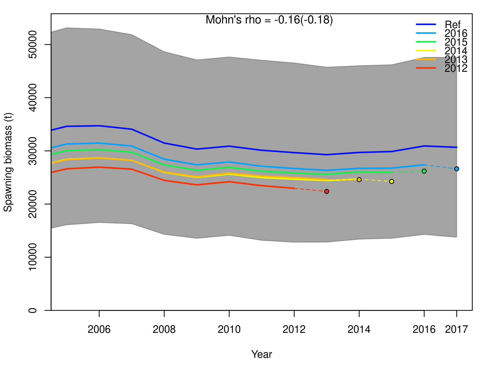

```{r,setup, include=FALSE}
library(knitr)
opts_chunk$set(cache=FALSE, echo=FALSE, fig.align="center", out.width="60%")
```

# WPTmT 2019 SA

# OM grid

# Partial

# Full

# Runs

# MPs

# Tests (perfect)


# WPTmT 2016 ALB OM

```{r}

```

# Analysis of 2016 grid

- What factors determine production, variability and status
- Adult M and ESS + CPUECV most important, then LLq

```{r, out.width="45%", fig.show="hold", fig.align="default"}
include_graphics(c("../figures/rec.png", "../figures/prodfun_OM.png"))
```

# Regression tree SB0

```{r, out.width="65%"}

```

# WPTmT 2019 SS3 albacore SA

- 2 sex, one area
- 4 LL fleets, DN (1982-92), PS (NW), Other.

```{r}
include_graphics(c("../data/SSdata.png"))
```

# WPTmT 2019 SS3 albacore SA

- 2 sex, one area
- 4 LL fleets, DN (1982-92), PS (NW), Other.

```{r, out.width="45%", fig.show="hold", fig.align="center"}
include_graphics(c("../figures/areas_albacore.png", "../data/index_selex_2017.png"))
```

# WPTmT 2019 SS3 albacore SA: indices

```{r}

```

# WPTmT 2019 SS3 albacore SA: recent indices

```{r}

```

# WPTmT 2019 SS3 albacore SA: runs

```{r}

```

# WPTmT 2016 and 2019 SS3 albacore SA: runs

```{r}

```

# Model diagnostics: Retrospective analysis

```{r}

```

# Model diagnostics: CPUE runs tests

```{r}
include_graphics("../base/runs_CPUE.png")
```

# Model diagnostics: LF runs tests

```{r}
include_graphics("../base/runs_LF.png")
```

# Model diagnostics: Hindcasting cross validation (MASE)

- 5 restropective runs (one year less each time).
- Project CPUE 1 year ahead based on catch
- Compare observation and prediction.

```{r, out.width="45%", fig.show="hold", fig.align="default"}
include_graphics(c("../base/mase1.png", "../base/mase3.png"))
```
- MASE < 1: LLCPUE3 S1, S4, LLCPUE1 S1, S4

# Parameter uncertainty: MVLN

```{r}
include_graphics("../base/kobe.png")
```

# Operating Model grid (WPM 2020)

- 6 factors, 2-4 levels each.
- Natural mortality (M):
  - 0.20, 0.25, 0.30 or 0.35, for all ages.
- SD recruitment deviates (sigmaR):
  - 0.4, 0.6, or 0.8.
- SRR steepness (h):
  - 0.7, 0.8 or 0.9.
- LL CPUE series (cpues):
  - Northwest (LLCPUE1, 12) or Southwest (LLCPUE3, 14).
- LF data lkhd weighting (lfreq):
  - 0.01, 0.1 or 1.
- Catchability increase LL CPUE (llq):
  - 0% or 1% per year.

- 4 x 3 x 3 x 2 x 3 x 2 = 432 runs

# Main effects: Change in SB0, SBMSY by factor

```{r, out.width="45%", fig.show="hold", fig.align="default"}
include_graphics(c("../maineffects/ssb0.png", "../maineffects/ssbmsy.png"))
```

# Partial factorial grid

- Federov's exchange algorithm (`AlgDesign::optFederov`)
- 84 runs
- Normalized variance = 0.95
- Equal numbers by level on all factors

```{r, out.width="40%"}
include_graphics("../partial/design_ntrials.png")
```

# Model grid results: SSB0 & stock trajectories

```{r, out.width="45%", fig.show="hold", fig.align="default"}
include_graphics(c("../partial/ssb0_distr_all.png", "../partial/stock_all.png" ))
```

- Run 6
  - M=0.25, sigmaR=0.6, h=0.9, CPUE SW, lfreq=0.01, llq=1

# Diagnostics: CPUE xval MASE

- 5 retrospective runs.
- Project CPUE 1 year ahead based on catch
- Compare observation and prediction.

```{r, out.width="50%"}

```

# Model selection & weigthing

- Model runs dropped if:
  - SSB0 > 0.5M t (1)
  - Convergence level > 1e-4 (5)
  - MASE (LLCPUE SW) > 1 (7)
- Model weight
  - P-value of Diebold-Mariano test LLCPUE SW cross-validation
  - Compares CPUE prediction and *naive* prediction ($I_y = I_{y-1}$)
```{r, out.width="40%"}

```

# Selected model runs

- 71 model runs left.
- Dropped runs: Lower sigmaR, high h, NW CPUE.

```{r, out.width="45%", fig.show="hold", fig.align="default"}
include_graphics(c("../partial/ssb0_distr.png", "../partial/status_distr.png"))
```

# Main factors for results: regression trees

- Scale (SB0), variability (sigmaR), status ($SB/SB_{MSY}$)

```{r, out.width="60%"}

```

# Resampling

- 500 resamples from 71 runs, weighted by DM p-value.
- Future SRR deviates: rho=0.45, sigma by run.
  - N: AC Lognormal
  - RHO: AC Lognormal at 2010-2015 level.
  - MOV: Lognormal with random walk.

```{r, out.width="45%"}

```

# OM runs: F=0

```{r, out.width="60%"}

```

# OM runs: F=FMSY

```{r, out.width="60%"}
include_graphics("../runs/runfmsy.png")
```

# OM runs: F=FMSY, recruitment deviances

```{r, out.width="60%"}

```

# OM runs: F=F2017

```{r, out.width="45%", fig.show="hold", fig.align="default"}
include_graphics(c("../runs/runf2017.png", "../runs/runf2017-rel.png"))
```

# Next steps

- Test tuning with perfect MP (perfect.oem, perfect.sa) (ongoing).
- Tuning with model-based MP (JABBA + 4010 HCR)
- Tuning with model-free MP (CPUE slope and distance to mean)
- TCMP tuning criteria (TCMP03):
  - 50% P(Kobe=green), over 2018-2039.
  - 60% P(Kobe=green), over 2018-2039.
  - 70% P(Kobe=green), over 2018-2039.
- Informative presentation to TCMP.
- Present final runs and platform to WPM / SC 2021.

## Elements under discussion

- Increase partial grid size to account for invalid runs.
- Updating OM to 2019 fwd(catch), 24 runs cannot sustain catches.

# Some questions

- SW LLCPUE model run, why the (larger) bump in SSB?
- Is selection and weighting scheme reasonable?
- Any other recruitment scenario? (normal, low, low to normal
- Possible ideas for robustness tests.
