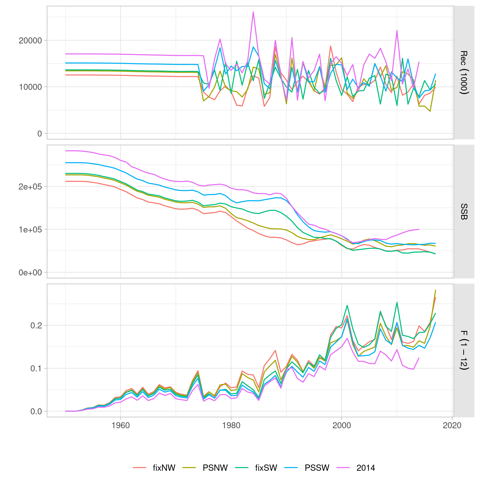
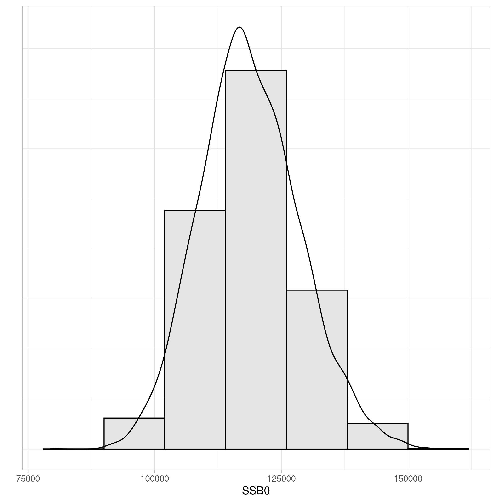

\thispagestyle{fancy}

```{r, knitr, echo=FALSE, message=FALSE}
library(knitr)
opts_chunk$set(echo=FALSE, message=FALSE, warning=FALSE, fig.align="center",
fig.width=6, fig.height=5, fig.pos='!htb', out.width="50%")
library(ggplot2)
library(data.table)
```

# Introduction

This document presents the current state of development for the conditioning of an Operating Model (OM) for Indian Ocean albacore. The OM is being used for the initial evaluation of Management Procedures for the stock following the guidelines providing by the 2021 meeting of the TCMP [@IOTC_TCMP04].

A new stock assessment for albacore [@Langley_2019] was carried out and accepted by WPTmT in 2019. A number of changes in both inputs and model structure led to a different perception of stock status and dynamics. This made the WPTmT request that the albacore OM be reconditioned based on the latest data, and using as base the new assessment model [@IOTC_WPTmT07AS].

Three system characteristics of the Operating Model and the Observation Error Model are likely to have the greatest influence in the performance of an MP: scale, noise and trend. The strategy for development of an MP described here tries to ensure that a realistic range of options for those three quantities are present in the OM set. Metrics that represent those three characteristics are described, but their suitability and usefulness needs further investigation.

Model runs have been selected based on four criteria realted to their fit to the data, predicition skill, and ability to explain recent catches. A large proportion of model runs did not pass these tests. Finally, the remnaining runs were resampled using sampling weights based on their predicditon skill for the two CPUE indices to be used in future projections.


# The WPTmT 2019 SS3 albacore stock assessment

The last session of the IOTC Working Party on Temperate Tunas, WPTmT [@IOTC_WPTmT07AS], reviewed and approved a new stock assessment [@Langley_2019] for the albacore stock. The model has been constructed using the Stock Synthesis platform [@Methot_2013], version 3.30. This is a seasonal, two-sex model, where catch data and indices of abundance are split across four areas (Figure \ref{fig:areas}), mostly to account for differences in the sizes of fish caught in the Northern and Southern areas.

```{r areas, fig.cap="Spatial structure of the Indian Ocean albacore SS3 stock assessment model."}

```

Data is available from the beginning of the industrial fisheries (Figure \ref{fig:data}), but their quality, and the amount of information contained, has varied over time through changes in the activities of some of the fleets, and lack of sampling in others.

```{r data, fig.cap="Temporal coverage and sources of catch, relative abundance and length composition data employed in the stock assessment model."}

```

Longline CPUE indices by area have been incorporated that are the result of a collaborative study across all longline fleets [@Hoyle_2019]. The standardised indices were derived from operational-level longline data from the three fleets (Japan, Taiwan and Korea), and using  cluster analyses to consider the effects of target change, vessel effects and spatial effects. Indices have been included for the period 1979–2017 (Figure \ref{fig:indices_recent}, as trends in years earlier than 1979 cannot be explained with the catches taken in those years.

```{r indices_recent, fig.cap="Indices of abundance employed in the SS3 stock assessment model in the later period."}

```

```{r base_runs, fig.cap="Time series (recruitment, SSB, catch and fishing mortality) for the three stock assessment runs used for advice by WPTmT (IOTC, 2019)."}
include_graphics("data/runs_wp_select.png")
```

Selectivities at age for the longline fleets in the four regions (Figure \ref{fig:cpueselex}) reflect the distinction in the ages available in the Northern and Southern areas of distribution. The effect of choosing a Northern or Southern index in a candidate MP will need to be considered, as they could be expected to provide information on different sections of the populations. Southern indices, for example, with a narrower selectivity profile, could be more affected by the delay between abundance signal and management. The current two year gap in data collection for albacore CPUE and catch data might prove important in those cases.

```{r cpueselex, fig.cap="Estimated selectivities at age for each of the four recent Longline CPUE indices (LLCPUE1-4).", fig.out="40%"}

```

The current stock assessment results in estimates of biomass that are approximately one third lower than those obtained by the 2016 model. There are four main changes in the new assessment ([@Langley_2019]):

- Refinements to the spatial distribution of catches from the longline fishery. Catches for the LL1 and LL2 fisheries have increased, while those for LL3 and LL4 have decreased.
- The main CPUE index in the assessment (LL3) has been revised and extended, and now shows a greater decline in stock abundance.
- A new set of growth parameters, obtained from work carried out on sampled from the Indian Ocean, are now used in the model.
- Changes in the configuration of the longline length composition data, which altered the estimates of both biomass and depletion level.

```{r runs2014, fig.cap="Stock trajectories for the three 2019 base case runs, compared with the WPTmT 2016 (SA2014) stock assessment.", fig.out="40%"}

```

Finally, the WPTmT considered that both natural mortality and stock-recruitment steepness were important factors that should ideally be considered in the stock assessment grid.

## Model diagnostics

An initial set of model diagnostics, following [-@Carvalho_2020], are being explored to (i) assess the quality of fit of each run in the grid, and (ii) use to provide weights to use in the resample procedure. Convergence is assessed by the invertion of the Hessian matrix, and the value of the gradient at the solution. This is checked to be smaller than 1e-4 [@Carvalho_2020].

### Retrospective analysis

Retrospective analysis is a form of hindcasting commonly used to assess the stability of a model formulation to updates in the data. An statistic, for example Mohn's *rho* [@Mohn_1999], is then used to quantify the strength of the retrospective pattern. A subjective rule might be established where model runs with values larger than a certain limit are deemed invalid. For example, [-@Hurtado_Ferro_2014] proposed that values outside the -0.15 to 0.20 range, should indicate an undesirable retrospective pattern for longer lived species.

The retrospective pattern for the estimated SSB from the base case model is shown in Figure \ref{fig:retrobase}. This plot also includes a one-step ahead projection of SSB based on the known total catches. The usefulness of a retrospective statistic is less clear in an operating model context, but has value at signalling models for which future bias could be a cause of instability in the application of an MP.

```{r retrobase, fig.cap="Five year restrospective runs with a one step ahead forecast of SSB according to total catch."}
include_graphics("base/retro_SSB.png")
```

### Runs tests

Runs tests on the CPUE and length-frequency data sources are common diagnostics of goodness of fit [@Carvalho_2017]. The Wald-Wolfowitz runs test, a non-parametric statistical test that checks the randomness hypothesis for a data sequence, can be used to identify residuals patterns that should not be considered random. The runs test for the CPUEs and for the length-frequency data sources in the base case stock assessment (Figures \ref{fig:runstestCPUE} and \ref{fig:runstestLF}) indicate that the model fit to most data series (those in red) present significant patterns. Model fits where the fit to the chosen CPUE does not pass the Wald-Wolfowitz runs test could be identified and not incorporated to the base case OM.

```{r runstestCPUE, fig.cap="Runs tests of the four ongoing CPUE series."}

```

```{r runstestLF, fig.cap="Runs tests for the various sources of length frequency data."}

```

### Hindcasting cross validation

A proposed model-free hindcasting technique (HCXval) uses cross-validation to compare observations to their predicted future values [@Kell_2016]. The prediction skill of a model is then computed from the prediction residuals. A robust statistic for evaluation the prediction skill can be constructed using the mean absolute scaled error (MASE) of [-@Hyndman_2006]. The R package *ss3diags* contains functions that simplify the calculation of prediction skill and the computation of their MASE for both CPUE and length frequencies.

The prediction skills of both the Northwestern (LLCPUE1) and Southwestern (LLCPUE3) indices are presented in Figure \ref{fig:mase1}. A MASE score larger than 1 indicates the model does only as well as a random walk at predicting the quantity, while a value of 0.5 indicates the model is twice as good as a random walk. For both indices, the model prediction skill appears to be better for seasons 1 and 4, the later being the spawning season for this stock. These results could indicate that a single season CPUE, or a combination of seasons 1 and 4, could provide a better indication of stock status and trends to inform the management procedure.

```{r mase1, fig.cap="Hindcasting cross-validation results by season for the LLCPUE1 and LLCPUE3 indices.", out.width="45%", fig.show = "hold", fig.subcap = c("a", "b")}
include_graphics(c("../report/base/mase1.png", "../report/base/mase3.png"))
```

## Parameter uncertainty

The previous albacore operating model did not incorporate parameter uncertainty, only considering the structural uncertainty as characterized by the variables included in the grid. A comparison of both sources of uncertainty should help informing on whether this should still be the case. Figure \ref{fig:kobe} presents the uncertainty in the estimates of current status, as generated from a Multivariate Log-Normal distribution [@Winker_2019].

```{r kobe, fig.cap="Uncertainty in the estimates of status (F/FMSY and B/BMSY) of the albacore base case model.", out.width="40%"}

```

An easier comparison can be made between the estimates of virgin biomass from the corners of the proposed grid (Figure \ref{fig:cornersssb0}) and the uncertainty in the estimate of biomass at the very start of the series (1952) obtained through the MVLN method (Figure \ref{fig:ssb1952}). It appears that the scale of variability is clearly lower, as expected, when only parameter uncertainty is considered.

```{r ssb1952, fig.cap="Uncertainty in the estimates of SSB in 1952 from the albacore base case model.", out.width="40%"}

```

# Operating Model grid

An analysis has been carried out (Kell et al, *unpublished*) attempting to extract some learnings about the process of setting up a grid that account for model uncertainty, using the albacore model grid as a case study. The main lessons of direct application to the new grid are the following:

- The effect of natural mortality was limited to the values chosen for mature ages, which are targeted and caught by the longline fisheries. As has been done in the new stock assessment [@Langley_2019], alternative values for M should be applied to all ages.

- Weighting of the length frequency (ESS) and CPUE data (CPUECV) have a strong impact on model estimates of both stock biomass and current status. The previous grid treated them as independent factors and considered all possible combinations of the levels for both. But it is the relative weight of either data source that needs to be considered. This is better set as a series of contrasting scenarios, in which the importance of the length frequency data is considered. This can now be carried out in a simpler manner in SS 3.30 by using multipliers for the two likelihood components (*lambdas*).

An initial proposal for an OM grid has been explored that includes the following factors and levels:

- Natural mortality (M): 0.3, 0.325, 0.35, 0.375  or 0.4, for all ages.
- Standard deviation in recruitment deviates (sigmaR): 0.4, 0.6, or 0.8.
- Stock-recruitment relationship steepness: 0.7, 0.8 or 0.9.
- LL CPUE series (cpues): Northwest (12) or Southwest (14).
- Length-frequency data likelihood weighting (lfreq): 0.001, 0.01, 0.1 or 1.
- Catchability increase of the LL CPUE series (llq): 0% or 1% per year.

## Limits to low natural mortality values

Initial design of the grid attempted to set alternative values for each factor on both sides of the base, except for those of a binary nature (e.g. choice of CPUE). For natural mortality, the initial choice was therefore for three values: 0.2, 0.3 and 0.4. Runs with M=0.2 resulted in unrealistic estimates of virgin biomass, larger than 1.5 Mt. The levels for this factor in the initial grid were reformulated to extend between the two alternatives already explored in the stock assessment grid, 0.3 and 0.4 [@Langley_2019]. Values lower than 0.3, for example 0.25, could be explored before a final grid is agreed.

## Main effects

A first exploration has been carried out of the individual effect on model output of adopting an alternative value for each variable, one at a time. These *main effects* provide an useful indication of how much variability in dynamics and status is controlled by a single variable, and how much is the result on 2nd or higher order interactions. The estimates of the scale indicator (virgin spawning biomass) are shown in Figure \ref{fig:mainssb0}, while those for trend (SSB in 2017 over SSB at MSY) are presented in Figure \ref{fig:mainssbmsy}.

```{r mainssb0, fig.cap="Changes in estimates of virgin spawning biomass (SSB0) under each factor and value. Horizontal line shows the reference estimate for the base case model run."}

```

```{r mainssbmsy, fig.cap="Changes in estimates of spawning stock biomass (SSB) in the last year (2017) over the SSB at MSY, under each factor and value. Horizontal line shows the reference estimate for the base case model run."}

```

# Partial factorial operating model

The last meeting of the MSE taskforce of WPM (IOTC, 2021), recommended that all operating models constructed around a grid of SS3 model runs should apply a partial factorial design to the full grid. This should allow running and inspecting a reduced number of models without a loss in its capacity to map stock uncertainty. Federov's exchange algorithm algorithm, as implemented in R packages 'AlgDesign'[^1], was used in this. An evaluation of the sampling design indicated that a value of 84 runs would be sufficient to obtain a robust representation of the grid uncertainty (close to 95%), as quantified by the minimax normalized variance (Figure \ref{fig:pfntrials}).

[^1]: <https://github.com/jvbraun/AlgDesign>

Once the selection citeria outlined below were applied to this subset, 38% of the chosen runs were to be rejected, leaving an OM grid composed of 52 model runs. Given that the size of the full grid, much reduced in this latest version, was considered not too large, and expecting a similar rejection rate as obtained in the partial factorial grid, the decision was taken instead to run the full grid of 432 models.

```{r pfntrials, fig.cap="Minimax normalized variance expressed as an efficiency with respect to the optimal approximate theory design (Geff) for an increasing number of trials."}
include_graphics("partial/design_ntrials.png")
```

# Full grid operating model

```{r loadfull}
load("../model/full/rate.RData")
```

The complete grid of model runs consists of 432 SS3 model configurations, derived from all combinations of the grid of six factors presented above.

## Selection process

Model runs from the full grid were then evaluated applying four diagnostic criteria. The objective was to retain only those model runs where convergence was assured, led to reasonable estimates of stock status, and had sufficient prediction skill:

1. Identify models leading to estimates of virgin biomass outside of a reasonable range (SB0 > 1e7), or overly optimistic estimates of recent stock status (SB 2017 / SBMSY > 3).

2. Signal models with no clear convergence of Stock Synthesis run, if final gradient > 1e-4

3. Identify runs where their MASE of selected CPUE indices (LLCPUE1 NW and LLCPUE3, SW) in seasons 1 and 4 were greater than 1.

4. Determine model runs that could not take the 2018 and 2019 nominal catches reported to IOTC (41,615 and 39,246 t, respectively) without an increase in fishing mortality effort larger than 200% over the 2017 value.

These four selection criteria were applied to the full OM grid of 432 Stock Synthesis model runs. The number of runs failing each of the individual tests were as follows:

- Unrealistic values: 10.
- Convergence: 26.
- MASE CPUE indices 1 and 3: 120.
- Catch 2018-2019 could not be taken: 132.

Model runs were kept in the OM set if they passed all four of those selection filters. This was the case for a total of 263 model runs out of 432 model configurations in the original grid, or around 61%. This model selection process leads to an uneven distribution of runs across three out of the six grid factors (Figure \ref{fig:selfactors}): natural mortality (M), weight of the length frequency data (lfreq) and yearly increase in LL CPUE catchability (llq).

```{r selfactors, fig.cap="Percentage of accepted OM runs across all factors and levels."}

# TODO CHANGE labels
raw <- melt(results[, .(M, sigmaR, steepness, cpues, lfreq, llq, sel)],
  measure.vars=c('M', 'sigmaR', 'steepness', 'cpues', 'lfreq', 'llq'))

dat <- raw[, .(percent=sum(sel) / 263), by=.(variable, value)]

ggplot(dat, aes(x=factor(value), y=percent)) +
  geom_bar(aes(fill=factor(value)), stat="identity") +
  facet_wrap(~variable, scales="free") +
  theme(legend.position="none") + ylab("% runs") + xlab("")
```

## Time series

The time series plot for this reference OM shows a large uncertainty in initial biomass and in current status, most notable on the level of fishing mortality (Figure \ref{fig:om}). The comparison with the stock trajectories estimated by the base case stock assessmnt model (Figure \ref{fig:omsa}) differ specially in the recent levels of fishing mortality and stock abundance. After projecting the stock for the catches reported in 2018 and 2019, the biomass levels appear to have turned to even lower values.

```{r om, fig.cap="Time series (recruitment, SSB, catch and fishing mortality) for the resampled operating model, projected ahead to 2019 based on total reported catches.", out.width="70%"}
include_graphics("full/om.png")
```

```{r omsa, fig.cap="Time series (recruitment, SSB, catch and fishing mortality) for the resampled oeprating model, projected ahead to 2019 based on total reported catches (OM) and the base case stock assessment model run (SA).", out.width="70%"}

```

Projections for MP evaluations using the reference OM will start from a stock status that is in a majority of cases (75%) worse than what the base stock assessment estimated (Figure \ref{fig:omsamsy}). This will likely call for a recovery phase. Management objectives might need to be realigned to ensure stock recovery in a reasonable time frame. Current tuning objectives, P(Kobe = green) of 50%, 60%, and 70% in 2030-2034, might only be achievable through a sharp decrease in allowable catches in the short term.

```{r omsamsy, fig.cap="Distribution of estimated values for stock status (${SB}_{2017} / {SB}_{MSY}$) compared to that obtained from the base case stock assessment model run (red line)."}

```

Displaying the time series of the main metrics for the OM, but split across levels of each grid factor (Figures \ref{fig:omfactors1} to \ref{fig:omfactors3}) shows how and in which way the OM runs diverge. Natural mortality values scale the biomass of the stock up or down, as expected (Figure \ref{fig:omfactors1}), while both the yearly increase in LL catchability (Figure \ref{fig:omfactors3}) and the choice of CPUE (Figure \ref{fig:omfactors1}), appear responsible for the two alternative trends in biomass over the 1980 to 2000 period.

```{r omfactors1, fig.cap="Time series (recruitment, SSB, catch and fishing mortality) for the resampled operating model, split across CPUE and natural mortality grid levels.", out.width="70%"}
include_graphics("full/om_factors-1.png")
```

```{r omfactors2, fig.cap="Time series (recruitment, SSB, catch and fishing mortality) for the resampled operating model, split across recruitment variance and steepness grid levels.", out.width="70%"}

```

```{r omfactors3, fig.cap="Time series (recruitment, SSB, catch and fishing mortality) for the resampled oeprating model, split across LL length frequency likelihood weight and yearly increase in LL CPUE catchability grid levels.", out.width="70%"}

```

The uncertainty in stock dynamics is also freflected in the range of estinmates for MSY reference points (Figure \ref{fig:omrefpts}).

```{r omrefpts, fig.cap="Distribution of estimated MSY reference points across the full OM grid.", out.width="80%"}

```

## Importance of grid factors and levels

- TODO

```{r omregk, fig.cap="Regression tree for all factors and levels in the filtered OM grid over carrying capacity ($K$).", out.width="70%"}

```

```{r omregdep, fig.cap="Regression tree for all factors and levels in the filtered OM grid over stock status ($SB/SB{0}$), defined as depletion level from virgin SSB in 2017.", out.width="70%"}

```

```{r omregr, fig.cap="Regression tree for all factors and levels in the filtered OM grid over the intrinsic rate of increase ($r$)."}

```

```{r omregsigma, fig.cap="Regression tree for all factors and levels in the filtered OM grid over the variance in stock-recruitment residuals ($\\sigma_{R}$)."}

```

## Short-term projections

The future dynamics and robustness of the OM have been first evaluated through a series of projections. They attempt to establish whether the population is able to sustain recent catch or fishing mortality levels over a number of years, and the expected impact of a short recovery to MSY conditions. 

Applying a catch level of 35,000 t, approximately equal to the catches of 2016, and lower than catches reported between then and 2019, leads to 76% of model iterations not being able to explain those catches if yearly increases in fishing mortality are limited to be no greater than 50% \ref{fig:runc19}.

When the OM is projected for the respective MSY catch levels across each run (Fifure \ref{fig:runmsy}), only 8% of the iterations are unable to sustain that catdch level over the same period. The large variability in the estimates of reference points \ref{fig:omrefpts} is reflected here in the disparity of catch targets able to maintain the stock at healthy levels, and the probability of catches like those observed in the recent past being extracted.

```{r runc19, fig.cap="Projection of the full OM for a catch level of 35,000 t over the 2020-2023 period."}

```

```{r runfmsy, fig.cap="Projection of the full OM for a catch level corresponding to the FMSY estimated for each model run over the 2020-2023 period."}

```

# Discussion

The OM presented here is the third iteration of a model grid-based conditioning for Indian Ocean albacore. The grid has been substantially reduced in size from the previous version, but still a large number of model formulations lead to results that can not be accepted. The selection steps outlined above led to almost half of those models being rejected, given the problems in convergence, extreme results in estimated carrying capacity or recent biomass, or their inability to predict the main source of information on stock abundance, the LL CPUE series. Management procedures for this stock will always depend on the ability of the standardized indices of abundance to track faithfully chmnages in stock abundance. Models that cannot make good use of this information, measured here by their prediction skill, have very limited value for simnulations of those MPs.

The stock status determined by the OM is in clear contrast with that obtained from the latest stock assessment in which it is based. The base case model run indicates a healthier stock, with respect to the management MSY reference points.

The nature of the catch and CPUE series, effectively a one way trip, appear to make the model runs heavily dependent on the values chosen for some of the model parameters.

# Acknowledgements

\textcopyright FAO 2020. This work is being funded by the Indian Ocean Tuna Commission - Food and Agriculture Organization of the United Nations (IOTC-FAO). The views expressed in this document are those of the author(s) and do not necessarily reflect the views or policies of FAO or IOTC.

# References

::: {#refs}
:::
